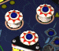

# '&lt;Flip Fall&gt;' f&uuml;r die Game++ #11 CC
Thema der GPPCC 11 - Thema 'Nach unten fallen'

## Idee meiner Frau

* Prinzip: Flipperkugel fällt nach unten
* Ziel: Falle so tief du kannst
* Hindernisse
    * ~~Platten - an denen du abprallst (Tempo runter)~~
    * 'Bumper' - die dich weg schleudern (Tempo links, rechts, rauf / extrem beschleunigt)
    * Flipper - die dich wieder nach oben katapultieren (Hindernisse von unten ignorieren?)
    * Fallen/Fallrohre - die dich fangen und das Spiel ist vorbei (?)
    * Fliegenfänger - verlangsamen dich eine Zeit lang
    * Stangen, Hütchen, Pinöpel - die dich abbremsen
    * Katapultflächen - die dich in eine bestimmte Richtung weg schießen
    * Schienen - die dich leiten und du so lange nicht steuern kannst
* Steuerung
    * mit Pfeiltasten o.ä.
    * Kugel wird in die gewünschte Richtung beschleunigt, nicht direkt bewegt
* Bonus
    * Combo-Punkte, wenn du fällst ohne etwas zu berühren
    * Tiefen-Punkte, je weiter du kommst desto mehr Punkte gibts (Faktor oder feste Bonuspunkte?)
    
    
## Steuerung und Bewegung
Der Spieler (Kugel) kann nur nach rechts und links bewegt werden. (Zu Anfang per Pfeiltasten.)

Da die Kugel permanent fallen wird, kann dies auch durch eine Aufwärtsbewegung des Hintergrunds erreicht werden. Die Kugel hat also einen festen y-Wert und der Hintergrund bewegt sich.

So braucht das Spiel nur einen einzigen Bewegungsvektor, welcher die Geschwindigkeit vorgibt. An diesem können alle Objekte berechnet und positioniert werden. Der Spieler nur durch den x-Wert und alle Objekte und der Hintergrund durch den y-Wert.

## Punkte
Um einen Anreiz im Spiel zu bekommen, werden im Laufe jeder Runde Punkte gesammelt. Dies passiert auf verschiedenste Weisen:

* Strecke: Mit jedem "Meter" die die Kugel fällt, gibt es Punkte. Wird der Spieler wieder hoch geschleudert, friert der Punktestand ein, bis der letzte, tiefste Punkt wieder erreicht ist.
* Objekte: Trifft die Spielerkugel z. B. einen Bumper, so gibt es einen festen Wert Punkte. Auch möglich sind Erhöhung oder Verringerung des Punktefaktors oder feste Minuspunkte bei Treffen bestimmter Objekte.
* Faktor: Der Punktefaktor beeinflusst die aktuellen Punkte, welche der Spieler im Moment erhält. So können die Punkte einfach Zählen oder auch doppelt, 1.5-fach oder sonstige Varianten.

## Objekte und Kollisionen
Verschiedene Objekte und Wände sollen den Spieler vom linearen Flug nach unten ablenken. Wie sie den Spieler beeinflussen und ob sie evtl. Punkte geben oder etwas besonderes auslösen, soll hier kurz zusammengefast werden.

### Bumper

Ein solches Objekt soll den Spieler bei Kollision mit hohem Tempo wegschleudern, in die Richtung aus der er kam. Dabei soll eine Treffer-Animation für den Bumper abgespielt werden und der Spieler erhält einen festen Satz Punkte (derzeit 100) pro Berührung.

### Stangen
Diese einfachen Stangen oder Nägel sind simple Hindernisse auf dem Spielfeld. Der Spieler wird davon abprallen wie an den Wänden und nicht besonders beschleunigt. Auch zusätzliche Animationen und Punktebonus sind nicht vorgesehen.