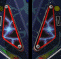

# '&lt;Flip Fall&gt;' f&uuml;r die Game++ #11 CC
Rahmenbedingungen:

* Thema des Spiels: 'Nach unten fallen'
* Umgebung: das Spiel muss auf einem Desktop (Win, Linux, Mac, etc.) laufen
* Abgabetermin: 23.09.2017 bis 23:59:59 Uhr

## Die Idee widerwillens
Eigentlich wollte ich die GPPCC11 für mich ausfallen lassen. Zur Zeit ist privat und beruflich so viel los, dass ich dafür kaum Zeit habe. Und eine Spielidee hatte ich auch nicht.

Nun schau ich mir den [Start-Aufruf](http://www.youtube.com/watch?v=eH9CzGkYtSw) von LetsGameDev an, wobei mir meine Frau über die Schulter schaut. Bei der Abstimmung über das Thema kam dann ein "Juchu!", gefolgt von "Ich hab da ne Idee. Du musst das programmieren. Ich mach die Grafiken."

Also verläuft die jetztige GPPCC für mich in völlig neuen Bahnen: nicht mehr als persönliches Geplänkel, sondern als Auftragsabreit mit fixem Termin. =D

Aber nun die Idee:

* Prinzip: Flipperkugel fällt nach unten
* Ziel: Falle so tief du kannst und hole die meisten Punkte
* Ende: eine Spielrunde geht 30 Sekunden ~~2 Minuten~~ (durch PowerUps verlängerbar)
* Hindernisse, die den Spieler bremsen / ablenken / helfen oder das Spiel beenden
    * Bumper - die dich weg schleudern (Tempo links, rechts, rauf / extrem beschleunigt)
    * Stangen, Hütchen, Pinöpel - die dich abbremsen
    * ~~Flipper - die dich wieder nach oben katapultieren (Hindernisse von unten ignorieren?)~~\*
    * ~~Fallen/Fallrohre - die dich fangen und das Spiel ist vorbei (?)~~\*
    * ~~Fliegenfänger - verlangsamen dich eine Zeit lang~~\*
    * ~~Katapultflächen - die dich in eine bestimmte Richtung weg schießen~~\*
    * ~~Schienen - die dich leiten und du so lange nicht steuern kannst~~\*
    * ~~Platten - an denen du abprallst (Tempo runter)~~
* Steuerung
    * mit Pfeiltasten o.ä.
    * Kugel wird in die gewünschte Richtung beschleunigt, nicht direkt bewegt
* Bonus
    * ~~Combo-Punkte, wenn du fällst ohne etwas zu berühren~~
    * Punkte-Faktor: je länger du fällst, ohne etwas zu berühren, desto mehr Punkte gibt es durchs Fallen
    * Tiefen-Punkte, je weiter du kommst desto mehr Punkte gibts ~~(Faktor oder feste Bonuspunkte?)~~
    
\*) Vorerst gestrichen, um das Spiel rechtzeitig 'fertig' zu bekommen.
    
    
## Steuerung und Bewegung
Der Spieler (Kugel) kann nur nach rechts und links bewegt werden. (Zu Anfang per Pfeiltasten.)

Da die Kugel permanent fallen wird, kann dies auch durch eine Aufwärtsbewegung des Hintergrunds erreicht werden. Die Kugel hat also einen festen y-Wert und der Hintergrund bewegt sich.

So braucht das Spiel nur einen einzigen Bewegungsvektor, welcher die Geschwindigkeit vorgibt. An diesem können alle Objekte berechnet und positioniert werden. Der Spieler nur durch den x-Wert und alle Objekte und der Hintergrund durch den y-Wert.

## Punkte
Um einen Anreiz im Spiel zu bekommen, werden im Laufe jeder Runde Punkte gesammelt. Dies passiert auf verschiedenste Weisen:

* Strecke: Mit jedem "Meter" die die Kugel fällt, gibt es Punkte. Wird der Spieler wieder hoch geschleudert, friert der Punktestand ein, bis der letzte, tiefste Punkt wieder erreicht ist.
* Objekte: Trifft die Spielerkugel z. B. einen Bumper, so gibt es einen festen Wert Punkte. Auch möglich sind Erhöhung oder Verringerung des Punktefaktors oder feste Minuspunkte bei Treffen bestimmter Objekte.
* Faktor: Der Punktefaktor beeinflusst die aktuellen Punkte, welche der Spieler im Moment erhält. So können die Punkte einfach Zählen oder auch doppelt, 1.5-fach oder sonstige Varianten.

## Objekte und Kollisionen
Verschiedene Objekte und Wände sollen den Spieler vom linearen Flug nach unten ablenken. Wie sie den Spieler beeinflussen und ob sie evtl. Punkte geben oder etwas besonderes auslösen, soll hier kurz zusammengefast werden.

### Bumper

Ein solches Objekt soll den Spieler bei Kollision mit hohem Tempo wegschleudern, in die Richtung aus der er kam. Dabei soll eine Treffer-Animation für den Bumper abgespielt werden und der Spieler erhält einen festen Satz Punkte (derzeit 100) pro Berührung.

### Nails (TODO)
Diese einfachen Stangen oder Nägel sind simple Hindernisse auf dem Spielfeld. Der Spieler wird davon abprallen wie an den Wänden und nicht besonders beschleunigt. Auch zusätzliche Animationen und Punktebonus sind nicht vorgesehen.

### Slingshots (TODO)

Ein Slingshot schießt den Spieler bei Berührung in eine bestimmte Richtung ab. Das Objekt wird dabei animiert und der Spieler bekommt einen festen Satz Punkte (evtl. 100).

## Schwierigkeitsgrade
Das Spiel soll eine Herausforderung und Jagd nach Highscores darstellen. Dazu sind anfangs zwei verschiedene Schwierigkeitsgrade angedacht:

* *Zufall*: Dieser Modus wird von Anfang an im Spiel enthalten sein. Hierbei ist das Level nicht vorgegeben, sodass die einzelnen Hindernisse zufällig auf dem Spielfeld positioniert werden. Dadurch entsteht jede Runde ein neues Spielfeld und es bietet so viel Abwechslung. Ein Vergleich der Highscores ist jedoch nur wenig sinnvoll, da keine zwei Spielrunden miteinander vergleichbar sind.
* ~~*Leicht*: In diesem Modus ist das Level bei jedem Start das Selbe. So kann mit viel Übung der Höchstsatz an Punkten erreicht werden. (Erst wenn das Spiel im 'Zufall'-Modus angenehm spielbar ist, wird dieser Modus eingebaut.)~~ //nach neuem Zeitsystem sind quasi endlose Level möglich -> überdenken

Zusätzlich wäre es später möglich, im Stil der leichten Herausforderung, weitere Schwierigkeitsgrade einzubauen.
